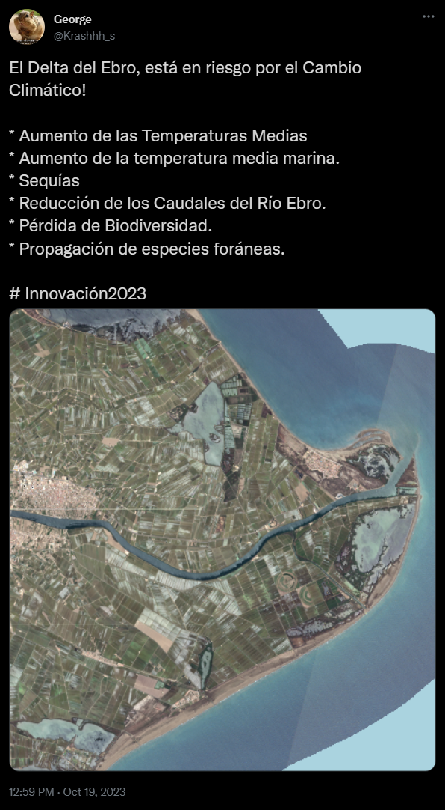

<!-- Comments -->

<!--Types of Syntax-->
<!--

 Plain Text // Texto Plano > Hola, mundo!
 Italic // Cursiva > _Hola, mundo!_ or *Hola, mundo!*
 Bold // Negrita > __Hola, mundo!__ **Hola, mundo!**
 Superscript // Superíndice > Hola, mundo!^2^
 Strikethrough // tachado > ~~Hola, mundo!~~
 link // Hipervínculo > [link](https://www.geografos.org/)
 
-->
 
<!--Script Syntax-->
<!--

Small Script > -- 
Large Script > ---
Ellipsis > ...

-->

<!--Tittle Syntax-->
<!--

# Heading 1  Hola, mundo!
## Heading 2  Hola, mundo!
### Heading 3 Hola, mundo!
#### Heading 4  Hola, mundo!
##### Heading 5  Hola, mundo!
###### Heading 6 Hola, mundo!

-->
<!--Equations Syntax-->

<!--

$A = \pi*r^{2}$

--> 

<!--Images-->

<!--

 

-->

<!--Blocks Quote-->

<!--

>Block

-->

<!--List-->

<!--

* unordered list 
* item 2 
 + sub-item 1 
 + sub-item 2 
 
1. ordered list 
2. item 2 
 + sub-item 1 
 + sub-item 2
 
-->

<!--Table-->

<!--

Table Header | Second Header 
------------- | ------------- 
Table Cell | Cell 2 
Cell 3 | Cell 4

-->

<!-- It is possible to add code execution cells with the shortcut CTRL+Alt+I -->

**_¡ Aviso para navegantes !_**: Hola a todos/as, bienvenidos/as a la clase _aditrevni_. En este documento web, se desarrollan parte de los conocimientos de climatología que debe tener un alumno de la asignatura optativa de Geografía de 2º de Bach. Es importante que presteís mucha atención y os leaís el documento detenidamente, ya que este tema es denso y además, es parte del temario de Selectividad. 

En la próxima clase, utilizaré estos contenidos como base para ampliar los conocimientos del tema. Además corregiremos los ejercicios y resolveremos las dudas que os hayan surgido. ¡Mucha Suerte! 

<div>
<p style = 'text-align:center;'>

</p>
</div>

# Un breve repaso...

## ¿Qué es el clima?

El clima es el resultado de la conjunción de variables físicas como la temperatura, la humedad, la presión o el viento  sobre un lugar determinado. Estas características, aunque varían en cortos periodos de tiempo, siguen una estructura que se repite con bastante frecuencia dando lugar a unos valores medios, que son los que explican algunos de los rasgos geográficos más característicos de una zona.

## ¿Qué disciplinas científicas estudian el clima?

1. Física de la atmósfera o **Meteorología**: Disciplina científica que estudia las leyes que gobiernan el funcionamiento del Sistema Climático. 

2. **Climatología**: Rama de la Geografía Física, que tiene como objeto de estudio la distribución espacial y el ritmo temporal de las variables del clima y su relación con otras del medio natural como la vegetación, los cultivos y el hombre. 

La diferencia entre ambas cada vez se va reduciendo más, pero de forma simplificada es posible decir, que el principal objetivo de la meteorología es *la predicción del tiempo*. Mientras que la climatología, tiene como principal finalidad *definir y caracterizar los diferentes tipos de climas que se observan en la superficie terrestre*.

## Diferencias entre tiempo y clima

* **Tiempo** : Situación meteorológica concreta que se observa sobre un lugar en
un momento determinado. Varía con bastante frecuencia de tal modo que un día puede ser muy distinto al que le precede. Incluso a lo largo del día el tiempo puede variar.

* **Clima**: Estado medio que se define por unos valores estadísticos deducidos 
de series largas. Se entiende por serie larga, el conjunto de datos adquiridos a lo largo de un periodo de 30 años, tal y como lo estipula la Organización Meteorológica Mundial (OMM). Al intervalo temporal que se utiliza para definir climas le denomina *“periodo internacional”*. A diferencia del tiempo, el clima sigue unos ritmos estacionales que se suceden regularidad, además es el clima el que define el tipo de vegetación, los cultivos etc. de una zona concreta. 


# Naturaleza y composición de la atmósfera.

A continuación podeís ver un vídeo que explica la naturaleza y composición de la atmósfera.


```{r,echo=FALSE}
library(vembedr)
embed_url("https://www.youtube.com/watch?v=J8xGEZT4Qa4")%>%
use_align("center")
```

# Estructura Vertical de la Atmósfera.
A continuación podeís ver un vídeo que explica la estructura vertical la atmósfera.

```{r,echo=FALSE}
library(vembedr)
embed_url("https://www.youtube.com/watch?si=xENdF6RLnRDWaPWM&v=DzXlKKn-ITE&feature=youtu.be") %>%use_align("center")
```

# Factores y Elementos del clima.
## Factores Climáticos

Se denominan factores climáticos al **conjunto de rasgos o características geofísicas y geográficas de las que dependen los mecanismos fundamentales del clima de una zona concreta**. Son de dos tipos: *cósmicos o astronómicos* y *geográficos*.

* **Factores Astronómicos**: Explican y condicionan la distribución espacial y las variaciones temporales 
de la energía procedente del Sol.

* **Factores Geográficos** : Influyen en la distribución espacial de los diferentes elementos del clima, 
dando lugar a una gran variedad de ellos.

### Factores cósmicos:

 1. **Forma y dimensiones de la Tierra**: Influyen sobre la variación latitudinal de la radiación 
solar.

2. **Movimientos de Rotación y Traslación**: Explican los regímenes térmicos: diarios y 
estacionales.

### Factores Geográficos:

1. **Altitud**: Influye sobre las temperaturas y las precipitaciones, tal influencia se manifiesta 
en los denominados gradientes térmicos y pluviométricos.

+ *_Gradiente Térmico_*: Descenso de la temperatura con la altura. Generalmente es negativo y se 
expresa en ºC/100 m.

+ *_Gradiente Pluviométrico_*: Aumento de la precipitación con la altura; se expresa en mm/100 m. 

+ *_Distribución de tierras y mares_*: Esta distribución espacial condiciona las oscilaciones térmicas a lo largo del año, dando lugar a los conceptos de oceanidad y continentalidad.

2. **Orientación de las alineaciones montañosas**: Produce diferencias térmicas y pluviométricas entre laderas.

3. **Características de la superficie terrestre**: Modifican la temperatura y la humedad del aire a pequeña escala.

## Elementos del Clima

Para el desarrollo de estudios climatológicos, se obtienen datos de las variables o elementos en las que suele dividirse el clima: _presión, viento, radiación, temperatura, humedad y precipitación_. Aunque las dos más importantes son la temperatura y la precipitación, pues se utilizan para definir y caracterizar los diferentes tipos de climas.

### Escalas Climáticas

#### Escala Temporal

La **variabilidad** es uno de los rasgos característicos del clima y hace referencia, tanto a los regímenes térmicos o pluviométricos como a la sucesión de años secos y húmedos. Esta variabilidad puede ser: 

* Diaria
* Mensual
* Interanual

Otro de los rasgos carácterísticos de la escala temporal es la tendencia. La **tendencia** se puede definir como el *conjunto de cambios a largo plazo provocados por modificaciones enalguno de los componentes del sistema climático.Estos cambios pueden ser debidos, tanto a causas naturales, como antrópicas*.

#### Escala Espacial

Los elementos del clima varían considerablemente de unos lugares a otros debido a la interacción de los diferentes factores. El resultado es la gran variedad de tipos de climas que se observan en la superficie terrestre. 

En el cuadro siguiente se presenta de forma simplificada la relación entre escalas, elementos y factores de los principales tipos de climas:

<style scoped>
table{
font-size: 14px;
}
</style>

Escala | Fact. Dominantes | Variable| Tipo de Clima | Características
------------- | ------------- | ------------- | ------------- | ------------- 
Planetaria | Astronómicos | Temperatura | Intertropicales, Templados, Fríos | Sin invierno/verano
Regional | Astronómicos y Geográficos | Temperaturas y Precipitaciones | Ecuatorial, Tropical, Monzónico, Oceánico, Continental, Mediterráneo |  Total pluviométrico y Regímenes pluviométricos diferenciados
Local | Geográficos | Amplitud Térmica | Continental y Oceánico | Amplitud térmica total, Régimen pluviométrico

Además de estos climas, aparecen otros en los que adquieren una importancia fundamental los factores geográficos y locales: son los denominados *climas azonales*, entre los que destacan los climas áridos, los de montaña y los microclimas.

# Las grandes zonas climáticas.

A continuación, podeis apreciar la distribución espacial de las grandes zonas climáticas del Planeta.

<div>
<p style = 'text-align:center;'>

</p>
</div>

# Clasificación de Koppën

En climatología existen diferentes formas de clasificar los climas de la Tierra, una de las más empleadas es la clasificación climática de Köppen.

El sistema de Köppen se basa en que la vegetación natural que tiene una clara relación con el clima, por lo que los límites entre un clima y otro se establecieron teniendo en cuenta la distribución de la vegetación. Los parámetros para determinar el clima de una zona son las temperaturas y precipitaciones medias anuales y mensuales, y la estacionalidad de la precipitación.

Divide los climas del mundo en cinco grupos principales: tropical, seco, templado, continental y polar, identificados por la primera letra en mayúscula. Cada grupo se divide en subgrupos, y cada subgrupo en tipos de clima. Los tipos de clima se identifican con un símbolo de 2 o 3 letras.

A continuación os muestro un ejemplo de como se realiza.

X | En. | Feb.| Marzo | Abril | Mayo | Jun. | Jul. | Ago. | Sept. | Oct. | Nov. | Dic.
------------- | ------------- | ------------- | ------------- | ------------- |------------- | ------------- |------------- | ------------- | ------------- |------------- |------------- |------------- |
Temperatura (ºC) | 0.1 |	0.1 |	0.6 |	3 |	6.6 |	9.5 |	11.2 |	10.7 |	8 |	4.4 |	1.9 |	0.6 | 
Precipitación (mm)| 83 |	85.9 |	81.4 |	56 |	52.8 |	43.8 |	52.3 |	67.3 |	73.5 |	74.4 |	78.8 |	94.1|

El clima que se presenta en la tabla, es un clima tipo C, que se caracteriza porque la temperatura media del mes más frío es menor de 18 °C y superior a -3 °C (en este caso 0.1 ºC) y la del mes más cálido es superior a 10 °C (aquí 11.2 ºC). Las precipitaciones exceden a la evaporación. Al estar las lluvias repartidas a lo largo del año y no existir extación seca, es posible determinar que  la subclasificación de este clima es Cf. Por último, este clima presenta cuatro meses al año con una media superior  a 10ºC y una oscilación térmica muy escasa, con temperaturas superiores a −3 °C y lluvias constantes y generalmente abundantes. Teniendo todos estos datos en cuenta es posible clasificar este clima como un clima Subpolar Oceánico (Cfc) en la clasificación de Köppen.

## Ejercicio 1

Clasificar los siguientes datos adquiridos de diferentes estaciones meteorológicas distribuidas a lo largo del mundo. Para el desarrollo de la clasificación, podeís apoyaros  en la tabla resumen que se presenta en el siguiente PDF y contiene los datos necesarios para realizar la clasificación climática de Köppen.

<object
type="application/pdf"
data="https://www.cen.edu/docs/upload/secundaria/muestras/geh_practica.pdf"
width = "1000"
height = "500"
>
</object>

\
Clima 1.

X | En. | Feb.| Marzo | Abril | Mayo | Jun. | Jul. | Ago. | Sept. | Oct. | Nov. | Dic.
------------- | ------------- | ------------- | ------------- | ------------- |------------- | ------------- |------------- | ------------- | ------------- |------------- |------------- |------------- |
Temperatura (ºC) | 6 |	9 |	12 | 18 |	22 |	27 |	28 |	27 | 24 |	18 |	11 |	7 | 
Precipitación (mm)| 10 |	11 |	8 |	5 |	7 |	15 |	42 |	42 |	34 |	20 | 10 |	16|

\
Clima 2.

X | En. | Feb.| Marzo | Abril | Mayo | Jun. | Jul. | Ago. | Sept. | Oct. | Nov. | Dic.
------------- | ------------- | ------------- | ------------- | ------------- |------------- | ------------- |------------- | ------------- | ------------- |------------- |------------- |------------- |
Temperatura (ºC) | -41 | -47 | -39 | -31 | -20 | -16 | -12 |	-18 | -21 |	-35 |	-42 |	-38 | 
Precipitación (mm)| 10 |	0 |	0 |	0 |	0 |	0 |	0 |	0 |	0 |	10 | 10 |	20|

\
Clima 3 .

X | En. | Feb.| Marzo | Abril | Mayo | Jun. | Jul. | Ago. | Sept. | Oct. | Nov. | Dic.
------------- | ------------- | ------------- | ------------- | ------------- |------------- | ------------- |------------- | ------------- | ------------- |------------- |------------- |------------- |
Temperatura (ºC) | 5 | 6 | 10 | 12 | 16 | 20 | 24 |23 | 20 |	14 |	9 |	5 | 
Precipitación (mm)| 43 |	44 |	35 | 45 |	44 |	28 |	11 | 11 |	30|	51 | 58 | 50|


## Ejercicio 2 

En el siguiente mapa web (Podeís jugar con él), es posible visualizar la localización de 5 lugares de gran interés climatologico. ¿Qué característica comparten en común?¿Qué factores y elementos climatologicos los condicionan?


```{python, echo=FALSE, results=FALSE}

import pandas as pd
import folium

m = folium.Map(location=(40.416775,-3.703790),tiles="OpenStreetMap", zoom_start=6)

data = pd.DataFrame({
   "lon":[-8.7226400, 0.85035,-5.880555, -0.98623, 0.8088888888],
   "lat":[42.2328200, 42.7256, 40.13972, 37.60512, 40.7025],
   "name":["Vigo", "Valle de Aran", "Valle del Jerte", "Campo de Cartagena", "Delta del Ebro"],
   "value":[10, 12, 40, 70, 23]
}, dtype=str)

for i in range(0,len(data)):
   folium.Marker(
      location=[data.iloc[i]['lat'], data.iloc[i]['lon']],
      popup=data.iloc[i]['name'],
   ).add_to(m)

m
```

\

# Aprendizaje Basado en Problemas 

Una vez que hemos comprendido el qué es el clima, cuáles son los factores fundamentales que influyen y como se distribuye zonalmente. Vamos a continuar con el temario con una nueva práctica basada en el aprendizaje por problemas.

El clima es un elemento y factor clave en la configuración del medio natural y fundamental en la actividad humana. Como bien sabeís es el determinante de la variedad de ecosistemas de paisajes y de la biodiversidad de un país y también el factor más importante de los recursos naturales, el potencial agrícola, ganadero y forestal.

Tras esta breve introducción, es posible constatar que existe una interrelación entre el clima, el ser humano y el territorio. Entender esta interrelación es crucial, para poder entender el temario como un “todo”, ya que en geografía todo está interconectado.

Actualmente debidos al drástico incremento de la población en las últimas décadas, ha aumentado notablemente la demanda de recursos naturales. Desencadenando en un aumento de la producción y por ende en un aumento del consumo energético, generado modificaciones en el sistema climático y dando una mayor vulnerabilidad frente al clima.

Bajo este contexto, la acción humana ha generado un incremento de la vulnerabilidad en ecosistemas de todo el mundo. También ha producido una transformación radical de los paisajes y se ha determinado que es la principal causante del calentamiento global.

El estudio del Cambio Climático se puede definir como el estudio de los cambios producidos en la atmósfera, y de las conexiones entre esta, la litosfera y la biosfera. En los últimos 3,2 millones de años, el clima de la tierra ha oscilado enormemente y ha alternado entre periodos de importante glaciación continental (períodos glaciales) e intervalos de climas más cálidos (períodos interglaciares). 

En la actualidad vivimos en un periodo interglaciar (el último fue aproximadamente hace 125.000 años). La comunidad científica ha constatado un aumento global de la temperatura media de la tierra, que posiblemente exceda a las elevadas temperaturas naturales de periodos interglaciares, es a este fenómeno al que se refieren como calentamiento global. Existe un amplio consenso científico sobre el hecho de que la emisión a la atmósfera de Gases de Efecto Invernadero) GEI por parte del hombre provoca una modificación en el balance de energía del sistema climático, conduciendo al calentamiento global.

El calentamiento acelerado del planeta, provoca cambios en otras variables naturales e impactos ambientales, tanto en el sistema natural como en las actividades humanas. En el caso de la atmósfera nos encontramos los siguientes cambios:

* Intensificación del Efecto Invernadero Natural 
*	Reforzamiento del efecto invernadero Desequilibrio en el balance de radiación del planeta Calentamiento global.
*	Aumento de temperaturas reducción de la cubierta hielo, retroceso de los glaciares (cambios en la Criosfera) y elevación del nivel del mar (cambios en la Hidrosfera).
*	Los cambios operados generan impactos sobre las plantas y animales, generando desplazamientos de hábitats (cambios en la Biosfera).

Algunos de los futuros impactos serán en: 

* Ecosistemas
* La salud 
*	Sectores claves como la agricultura y los recursos hídricos
*	Infraestructuras y asentamientos humanos 

Estos impactos serán especialmente graves en países en desarrollo y entre los sectores de población más desfavorecidos de todos los países, ya que aumentará aún más las desigualdades existentes.

El actual cambio del clima es fenómeno global, por lo tanto, sus efectos como sus causas son una realidad observable, que se manifiesta en el planeta.

## Aspectos a destacar del Cambio Climático.

El calentamiento del sistema climático es inequívoco, y, desde los años 50 del siglo XX, muchos de los cambios observados no tienen precedentes en décadas a milenios. La atmósfera y el océano se han calentado, los totales de hielo y nieve han disminuido, el nivel del mar se ha elevado y las concentraciones de gases de efecto invernadero han aumentado”. Por lo tanto, una de las características más importantes de este fenómeno es su celeridad. El otro aspecto relevante, son sus causas, de origen antrópico.

## Acciones Clave para evitar el Impacto del Cambio Climático:

* Mitigación: Reducir emisiones de GEI para que el calentamiento sea el mínimo posible.

* Adaptación: Ajustarse a las nuevas condiciones ambientales reduciendo el efecto de los impactos y aprovechando las nuevas oportunidades.

En el contexto de la ONU, la respuesta multilateral frente al Cambio Climático, se materializó en 1992 con la Convención Marco de Naciones Unidas sobre Cambio Climático (CMNUCC), en 1997 con el Protocolo de Kioto y ha ido evolucionando hasta la adopción del Acuerdo de Paris en 2015.

# Justificación según el Marco Legislativo.

Esta actividad está directamente relacionada con las siguientes competencias específicas de la asignatura optativa de geografía de 2º de Bachillerato:

Competencia Específica 1.:

1.1.	Cuestionar modos de vida insostenibles mediante el análisis geográfico de todo tipo de fuentes de información que trate de los retos ecosociales presentes y futuros, y desde argumentos fundados en la relevancia y necesidad de las acciones para afrontarlos. 

1.2.	Debatir sobre los retos naturales y sociales de España de forma comprometida y respetuosa con opiniones ajenas, utilizando estrategias orales con apoyo digital de gráficos, imágenes y cartografía, y manejando datos rigurosos.  

Competencia Específica 2.: 

2.1. Valorar todo impacto de la acción antrópica desde el principio de sostenibilidad, reconociendo la complejidad sistémica del medio natural y de las propias actividades humanas.

Competencia específica 4.:

4.1. Emplear la escala apropiada para localizar o representar, con apoyo de las TIG, cualquier fenómeno físico o humano, justificando los métodos y datos elegidos, y la delimitación de regiones o categorías de análisis, así como de áreas de transición.

4.2. Crear productos propios individuales o en grupo con fines explicativos comunicando diagnósticos, proponiendo hipótesis o conclusiones, y aplicando las TIG.

Competencia específica 5.:

5.1. Expresar la necesidad de preservar el medio ambiente, indagando sobre los impactos de los modos de producción, distribución y consumo a escala local y global, y proponiendo actuaciones de mejora.

Estas competencias están relacionadas principalmente con el siguiente saber básico: (B). La sostenibilidad del medio físico de España.

* Factores físicos y diversidad de paisajes y ecosistemas. Análisis de los condicionantes geomorfológicos, bioclimáticos, edáficos, hídricos y relativos a las actividades humanas y prevención de los riesgos asociados para las personas. 

* Diversidad climática de España. Análisis comparativos de distribución y representación de climas. Emergencia climática: cambios en los patrones termopluviométricos; causas, consecuencias y medidas de mitigación y adaptación. Estrategias de interpretación del tiempo y alertas meteorológicas; webs y aplicaciones móviles.

* Biodiversidad, suelos y red hídrica. Características por regiones naturales. Impacto de las actividades humanas y efectos sobre las mismas: pérdida de biodiversidad, de suelos y gestión del agua. Interpretación de imágenes, cartografía y datos. Riesgos generados por las personas. 

* Políticas ambientales en España y la Unión Europea: uso de herramientas de diagnóstico. La red de Espacios Naturales Protegidos y la red Natura 2000. El debate sobre los cambios del modelo de desarrollo: el principio de sostenibilidad.

# Planeamiento del Problema. El Delta del Ebro y su vulnerabilidad al cambio climático.

El Río Ebro conforma, en su tramo final, uno de los accidentes geográficos y ecosistemas de mayor riqueza natural de España; el Delta del Ebro. Un delta, es un accidente geográfico convexo formado por la deposición de sedimentos en la desembocadura de un río. Están compuestos por brazos fluviales que conforman islas de sedimentos, lo que en los ríos más grandes generan algo similar a canales que se separan y se juntan. 

En este caso concreto, el delta del Ebro, es el cuarto más grande de la cuenca mediterránea con una extensión de 350 kilómetros cuadrados. Se sitúa entre Valencia y Barcelona, en la provincia de Tarragona, al este de la Península Ibérica.

Una de las características más reseñables de este delta es la cohabitación humana con el ecosistema natural, principal característica de la zona. De esta manera, es posible encontrar un mosaico conformado por diferentes usos del suelo como son: huertos, frutales y arrozales, a la vez que dunas, lagunas, playas, marismas y demás vegetación autóctona. Es por ello que presenta una gran diversidad y riqueza biológica. Por este motivo, en el año 1983, la Generalitat constituyó el Parque Natural del Delta del Ebro en 1983, y en 2013 fue declarado Reserva de la Biosfera y Zona de Especial Protección para las Aves (ZEPA). 

El Delta del Ebro es un espacio extremadamente vulnerable a los impactos del cambio climático y a una deficiente gestión de la cuenca del río, tanto en cuanto a la aportación de caudales de agua como de sedimentos.

Vulnerabilidades del Delta del Ebro al Cambio Climático:

* Aumento de las Temperaturas Medias
* Disminución de las Precipitaciones
* Aumento de la temperatura media marina. Favoreciendo la aparición de fenómenos climáticos extremos asociados como por ejemplo, las Depresiones Aisladas a Niveles Altos (DANA).
* Pérdida de Zonas Húmedas
* Pérdida de Zonas de Cultivo
* Sequías
* Pérdida de Paisajes Culturales
* Reducción de los Caudales del Río Ebro y por lo tanto, la pérdida de aportación de sedimentos.
* Pérdida de Biodiversidad
* Condiciones ambientales beneficiosas para la propagación de especies foráneas.

## Cartografía

El siguiente mapa web, están representadas una serie de capas geográficas que nos  permiten conocer la evolución reciente (2017-2022) del Delta del Ebro. 

* Las capas catalogadas con la etiqueta S-2 RGB. Son imágenes tomadas por los satélites Sentinel-2, pertenecientes al Programa Copernicus de la Unión Europea, destinados a la obtención de imágenes para monitorización medioambiental. En este caso se presentan imágenes en color RGB de alta resolución.

* Las capas catalogadas con la etiqueta S2-IRC. Son imágenes tomadas por los satélites Sentinel-2, pertenecientes al Programa Copernicus de la Unión Europea, destinados a la obtención de imágenes para monitorización medioambiental. En este caso se presentan imágenes a las que se les ha aplicado una transformación Tasseled Cap. Esta transformación es una de las más extendidas en el mundo de la teledetección para el análisis del vigor de la vegetación, poniendo en relación las bandas de infrarrojo cercano (NIR) y rojo (R).


* Las capas catalogadas con la etiqueta S2-NDVI. Son imágenes tomadas por los satélites Sentinel-2, pertenecientes al Programa Copernicus de la Unión Europea, destinados a la obtención de imágenes para monitorización medioambiental. En este caso se presentan imágenes a las que se les ha aplicado un índice NDVI. Este índice, junto a Tasseled Cap es uno de los más extendidos en el mundo de la teledetección para el análisis del vigor de la vegetación, poniendo también en relación las bandas de infrarrojo cercano (NIR) y rojo (R).


```{python, echo=FALSE, results=FALSE}
import folium

map_geo = folium.Map(location=[40.7025, 0.8088888888], zoom_start=13)

folium.raster_layers.WmsTileLayer(url = 'https://geoserveis.icgc.cat/icgc_sentinel2/wms/service?',
                                  layers = 'sen2rgb_202205',
                                  transparent = True, 
                                  control = True,
                                  fmt="image/png",
                                  name = 'S-2 2022',
                                  overlay = True,
                                  show = True,
                                  ).add_to(map_geo)
                                  
folium.raster_layers.WmsTileLayer(url = 'https://geoserveis.icgc.cat/icgc_sentinel2/wms/service?',
                                  layers = 'sen2irc_202205',
                                  transparent = True, 
                                  control = True,
                                  fmt="image/png",
                                  name = 'S-2 IRC22',
                                  overlay = True,
                                  show = True,
                                  ).add_to(map_geo)

folium.raster_layers.WmsTileLayer(url = 'https://geoserveis.icgc.cat/servei/catalunya/ndvi/wms',
                                  layers = 'ndvi_color_2022',
                                  transparent = True, 
                                  control = True,
                                  fmt="image/png",
                                  name = 'NDVI 2022',
                                  overlay = True,
                                  show = True,
                                  ).add_to(map_geo)

                                  
folium.raster_layers.WmsTileLayer(url = 'https://geoserveis.icgc.cat/icgc_sentinel2/wms/service?',
                                  layers = 'sen2rgb_201905',
                                  transparent = True, 
                                  control = True,
                                  fmt="image/png",
                                  name = 'S-2 2017',
                                  overlay = True,
                                  show = True,
                                  ).add_to(map_geo)
                                  
folium.raster_layers.WmsTileLayer(url = 'https://geoserveis.icgc.cat/icgc_sentinel2/wms/service?',
                                  layers = 'sen2irc_201905',
                                  transparent = True, 
                                  control = True,
                                  fmt="image/png",
                                  name = 'S-2 IRC19',
                                  overlay = True,
                                  show = True,
                                  ).add_to(map_geo)

                                  
folium.raster_layers.WmsTileLayer(url = 'https://geoserveis.icgc.cat/servei/catalunya/ndvi/wms',
                                  layers = 'ndvi_color_2019',
                                  transparent = True, 
                                  control = True,
                                  fmt="image/png",
                                  name = 'NDVI 2019',
                                  overlay = True,
                                  show = True,
                                  ).add_to(map_geo)
                                  
folium.raster_layers.WmsTileLayer(url = 'https://geoserveis.icgc.cat/icgc_sentinel2/wms/service?',
                                  layers = 'sen2rgb_201705',
                                  transparent = True, 
                                  control = True,
                                  fmt="image/png",
                                  name = 'S-2 2017',
                                  overlay = True,
                                  show = True,
                                  ).add_to(map_geo)
                                  
folium.raster_layers.WmsTileLayer(url = 'https://geoserveis.icgc.cat/icgc_sentinel2/wms/service?',
                                  layers = 'sen2irc_201705',
                                  transparent = True, 
                                  control = True,
                                  fmt="image/png",
                                  name = 'S-2 IRC17',
                                  overlay = True,
                                  show = True,
                                  ).add_to(map_geo)
                                  

folium.raster_layers.WmsTileLayer(url = 'https://geoserveis.icgc.cat/servei/catalunya/ndvi/wms',
                                  layers = 'ndvi_color_2017',
                                  transparent = True, 
                                  control = True,
                                  fmt="image/png",
                                  name = 'NDVI 2017',
                                  overlay = True,
                                  show = True,
                                  ).add_to(map_geo)
                                  

folium.LayerControl().add_to(map_geo)

map_geo

```

Los servicios Web Map aquí representados, son ofrecidos por el Instituto Cartográfico y Geológico de Cataluña.


## Posibles soluciones y actividades en marcha.

Entre las posibles soluciones a esta  problemática son:

* Plantear un proyecto de Ordenación del Territorio, consensuado y asumido por todos los actores, que permita definir un nuevo modelo de gobernanza.

* Implantar unos caudales ambientales en el río Ebro para mantener la estructura y el funcionamiento del río y del Delta, y la restauración del flujo de sedimentos.

* Recuperar la función protectora de los sistemas costeros y trabajar conjuntamente con los procesos naturales para paliar la subida del nivel del mar y la regresión de la línea de costa.

* Desarrollar medidas de ingeniería clásica. 

* Control de la distribución de especies invasoras.

## Cuestiones

1. ¿Crees que se está haciendo lo suficiente para mitigar los efectos del Cambio Climático por parte de los Gobiernos? 

2. ¿Qué otras actuaciones ves posibles en el Delta del Ebro para mitigar los efectos del Cambio Climático?

3. ¿Crees que las tecnologías de la información geoespacial son una herramienta imprescindible para la lucha contra el Cambio Climático? 

## Divulgación Social.

<div>
<p style = 'text-align:center;'>

</p>
</div>

# Análisis Crítico de la Teoría de las Inteligencias Múltiples.
Para poder realizar un análisis crítico sobre la Teoría de las Inteligencias Múltiples, es necesario en primer lugar definir qué se entiende por inteligencia. En la década de los años sesenta con la aparición y desarrollo de la psicología cognitiva comienza a cuestionarse las definiciones de inteligencia, presentes en la época (Monteros Molina, J.M., 2006). El debate, continua hoy en día, pues no existe consenso científico sobre como definir la inteligencia, debido a que no solo es un término confuso, sino que además está muy influenciada a nivel cultural. Es decir, su definición varía según como se valoren ciertas capacidades como propias de la inteligencia, en un determinado espacio y tiempo. Un ejemplo de ello es, que en un determinado momento de la historia se realzaba la capacidad adaptativa, aspecto propio de la teoría darwiniana y en otro, se resaltaba la capacidad solucionar problemas (Villamizar & Donoso, 2013).

Actualmente es posible definirla como: la facultad o capacidad de la mente que permite aprender, entender, razonar, tomar decisiones y formarse una idea determinada de la realidad (Oxford, 2023). Otra definición interesante, es la que percibe la inteligencia como una actividad psíquica compleja que comprende la organización de nuestras habilidades para enfrentar situaciones problemáticas empleando nuevos recursos o procedimientos, resolviendo dichas situaciones de manera eficiente (Chura, 2016).

Una vez examinado y definido el concepto de inteligencia, vamos a analizar de manera crítica la Teoría de las Inteligencias Múltiples. Esta teoría fue desarrollada por estadounidense Gardner en contraposición al paradigma de una inteligencia única, generando una revolución pedagógica. Gardner considera que no existe una única inteligencia, sino que cada persona posee al menos ocho inteligencias: inteligencia lingüística, lógico-matemática, cinestésico-corporal, musical, espacial, naturalista, interpersonal e intrapersonal (Carrillo y López, 2014). Estas inteligencias, son autónomas y se interrelacionan entre sí, permitiendo que se desarrollen y manifiesten de forma distinta e individual, por este motivo, hay inteligencias que tienen un mayor desarrollo que otras, dotando a todos los individuos de una inteligencia particular (Sánchez, 202).

Tras una extensa revisión bibliográfica, es posible determinar, que la Teoría de las Inteligencias Múltiples no es adecuada. Aunque Gardner, base su teoría sobre los avances de la neurobiología de la época, no tiene fundamento científico y presenta poca evidencia empírica sobre los principios propuestos de la teoría. Además, con posterioridad a la publicación de su estudio, del que posteriormente se retractó, no realizó ningún estudio que comprobase o refutase sus ideas. La evidencia científica contradice la supuesta independencia entre inteligencias, comprobando la compartición de caminos neuronales por distintas habilidades cognitivas (Sánchez, 2022).

Con posterioridad, el propio autor del estudio reconoció que se equivocó a la hora de llamarlas inteligencias y que si las hubiese llamado talentos no hubiese sido tan criticado. Pero no son inteligencias, puesto que la inteligencia es una habilidad cognitiva muy general que interviene en muchas de esas habilidades (Pellicer, 2021).  

Aunque la idea inicial de Gardner fue errónea y no podía sustentarse empíricamente, es cierto que favorecido que muchas personas se den cuenta de que quizás deben tener una visión más amplia a la hora de valorar las habilidades a las que se da importancia en la escuela (Pellicer, 2021). Y no solo en la escuela, en la actualidad existe una tendencia cada vez mayor a valorar las habilidades blandas o “soft skills” en el mercado laboral. Por lo tanto y a modo de conclusión, es posible afirmar que, aunque Gardner generó una teoría errónea, está ha terminado contribuyendo a una mejor comprensión de la mente humana y a la valoración de las habilidades de cada individuo.

# Bibliografía

1. Fernández García, F (2006): La Diversidad Climática de España. Explicación, comprensión y enseñanza. El espacio geográfico español y su diversidad. Ministerio de Educación y Ciencia, Instituto Superior de Formación del Profesorado, Madrid 2006, pp. 9-37 ISBN: 84-369-4266-3.

2. Strahler, N. y Strahler, H. (1989): Geografía Física.Capítulo 9. Clasificación de los climas, pp. 147-190.

3. Clasificador Climático Köppen (2023). Disponible en: https://fcalzado.es/climograma/index.html

4. Keller, E. A., & Blodgett, R. H. (2007). Riesgos naturales: procesos de la Tierra como riesgos, desastres y catástrofes. Prentice Hall.

5. IPCC, 2022: Summary for Policymakers

6. Generalitat de Catalunya (2023). El delta del Ebro y el Cambio Climático. Disponible en: https://climadeltaebre.cat/es/

7. Monteros Molina, J. M. (2006). Génesis de la teoría de las inteligencias múltiples. Revista Iberoamericana de Educación (ISSN: 1681-5653). Disponible en: https://rieoei.org/RIE/article/view/2596/3582 

8. Villamizar, G., & Donoso, R. (2013). Definiciones y teorías sobre inteligencia. Revisión histórica. Psicogente, 16(30). https://doi.org/10.17081/psico.16.30.1927 

9. Bases epistemológicas que sustentan la teoría de las inteligencias múltiples de Howard Gardner en la pedagogía. (2019). Revista Innova Educación, 1(4), 589-598. https://revistainnovaeducacion.com/index.php/rie/article/view/62

10. Chura, E. (2016). Psicología Humana (1ra Ed.). Arequipa, Perú: Chaparro Editores.

11. Sánchez, R. M. (202). Las inteligencias múltiples no existen, son un mito. Mente y Ciencia. https://www.menteyciencia.com/las-inteligencias-multiples-no-existen-son-un mito/ 

12. Carrillo, M. E., & López, A. (2014). The multiple intelligence theory for the teaching of languages. Revista de Educación: Contextos Educativos, 17(1), 79-89. https://doi.org/http://dx.doi.org/10.18172/con.2594 

13. Pellicer, C. (2021). Entrevista a Héctor Ruíz Martín. Director De International Science Teaching Foundation. Cuadernos de Pedagogía, Nº 521. Disponible en: Cuadernos de Pedagogía - Documento (cuadernosdepedagogia.com)

14. Oxford. (2023). Diccionario Oxford.


